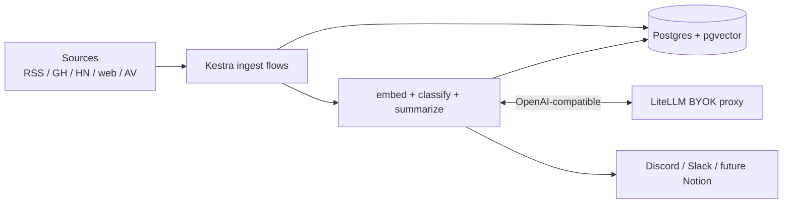

# Lighthouse Architecture

## Runtime diagram

## Data model (`lh` schema)

| Table | Notes |
| --- | --- |
| `documents` | Canonical ingested items |
| `embeddings` | 1536-d vectors (OpenAI `[small|3-small]` via LiteLLM) |
| `classifications` | LLM labels |
| `briefs` | Daily Markdown artifacts |
| `chat_history` | RAG chat transcripts |

## LLM path

1. Docker Compose injects secrets into Kestra (`SECRET_LITELLM_*`).
2. Scripts and AI tasks call LiteLLM using `baseUrl` + master key.
3. LiteLLM forwards to OpenAI / Azure / others based on `infra/litellm/config.yaml`.

## Triggers

- **Schedules** on ingest + `embed_dedup` + `cluster_summarize` + `deliver.brief`.
- **Flow triggers** chaining ingest → `embed_dedup`, plus namespace-wide failure → `monitors.alerts`.
- **Webhooks** for Miniflux, chat, Apps experiments.

## Operational notes

- `./scripts/*` heavy lifting runs in `lighthouse/worker:latest`.
- Tune `flows/process/classify.yaml` batch sizes for cost guardrails.
