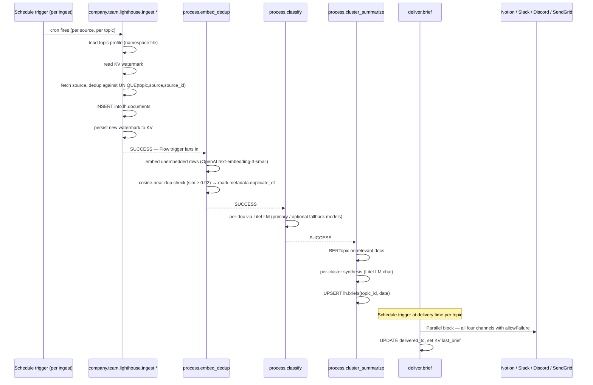
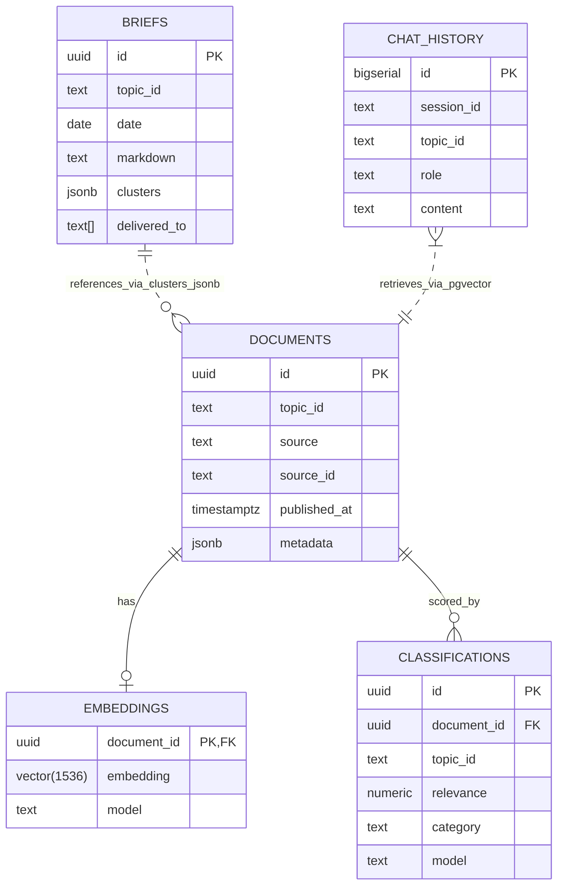

# Lighthouse — Architecture

This document is the deep-dive companion to the README. It assumes you've
already read [`CONVENTIONS.md`](CONVENTIONS.md) for naming, namespaces, secret
keys, and schemas.

## 1. Stack at a glance

| Layer | Tool | Why |
| --- | --- | --- |
| Orchestrator | Kestra LTS | Native realtime + schedule + Flow triggers, AI plugin, Apps, KV, secrets, namespace files, MCP |
| Storage | Postgres 16 + pgvector | Same DB Kestra uses; one less moving part. HNSW index for cosine retrieval |
| RSS aggregator | Miniflux | Webhooks → realtime trigger; fever/google-reader API for tooling |
| Meta-search | SearxNG | Backs the chat App's optional web search; same backend Perplexica uses |
| Worker image | Debian-slim Python 3.11 | yt-dlp, faster-whisper, trafilatura, gpt-researcher, bertopic, sentence-transformers, markitdown, playwright |

## 2. Sequence — daily brief, end-to-end



## 3. Postgres schema

See [`sql/schema.sql`](sql/schema.sql) for the source of truth. Key relationships:



The `UNIQUE (topic_id, source, source_id)` constraint on `documents` makes the
ingest path idempotent at the source level; the cosine threshold on
`embeddings` catches semantic duplicates across sources (e.g. same news item
posted to HN and an RSS feed).

## 4. The multi-LLM fallback pattern (and why it's everywhere)

Pattern source: Kestra's [May 7 2026 production AI workflows blog](https://kestra.io/blogs/ai-workflows-in-production).

Each LLM step is a **chain of three tasks**:

```yaml
- id: tier_1_primary       # cheap, fast, default
  type: io.kestra.plugin.ai.completion.Classification
  allowFailure: true
  retry: { type: constant, maxAttempts: 3, interval: PT1S }
  ...

- id: tier_2_fallback
  runIf: "{{ outputs.tier_1_primary.classification is null }}"
  ...same shape...

- id: tier_3_fallback
  runIf: |
    {{ outputs.tier_1_primary.classification is null
       and outputs.tier_2_fallback.classification is null }}
  ...same shape...
```

Why this beats a single LLM call:

- **Cheap by default.** Tiered models live in LiteLLM config (`LITELLM_MODE` single vs multi);
  Kestra always talks to one OpenAI-compatible base URL.
- Robust to provider outages and per-account rate limits.
- We **record which tier won** in the `model` column → easy cost / quality
  attribution later.

We applied the *exact same shape* to extraction in `flows/ingest/web_articles.yaml`:
Trafilatura → Jina Reader → Playwright. The fallback pattern is independent
of "AI"; it's just disciplined error handling that Kestra makes ergonomic.

## 5. Topic profiles — namespace files as configuration

Profiles live at `flows/_namespace_files/topics/<id>.yaml` and are loaded by
flows via `io.kestra.plugin.core.namespace.DownloadFiles`. Switching the
active topic is just changing `inputs.topic_id` — every flow is parametric.

The dashboard App's topic picker writes the chosen topic to a Form input
which then drives the chat / deepdive sub-app submissions. Adding a fifth
topic is one new file plus a Discord webhook secret.

## 6. Retry / fallback rationale

| Surface | Strategy | Why |
| --- | --- | --- |
| External HTTP (Miniflux, GitHub, HN, Reddit) | `retry.constant maxAttempts: 5 interval: PT2S` | Cheap retries, transient 5xx common |
| LLM calls | `retry.constant maxAttempts: 3 interval: PT1S`, plus tier fallback | Per-tier retry handles transient errors; fallback handles persistent ones |
| Extraction | Tier fallback only (no per-tier retry beyond 1–3) | Persistent extraction failures want a different tool, not the same one again |
| Delivery channels | `allowFailure: true` + retry | Notion outage shouldn't block Slack post |
| Postgres | No retry; transactional | If the DB is down we want to fail loud |

## 7. Namespace layout

```
company.team.lighthouse.ingest.*
company.team.lighthouse.process.*
company.team.lighthouse.deliver.*
company.team.lighthouse.serve.*
company.team.lighthouse.monitors
company.team.lighthouse.maintenance
company.team.lighthouse.tests
```

The single-alert flow (`monitors.alerts`) listens with a Flow trigger using
`ExecutionNamespaceCondition prefix=true` against `company.team.lighthouse`,
so any new sub-namespace we add is monitored for free.

## 8. Apps

Three Apps live under `company.team.lighthouse.serve`:

- `dashboard` — topic picker + today's brief preview + jump links.
- `chat` — Form → `serve.chat_brief` (vector search + multi-LLM RAG) → Markdown
  rendering. Persists chat to KV (`chat:<session>:history`) and `lh.chat_history`.
- `deepdive` — Form → `serve.deepdive` (GPT-Researcher in Docker) → Markdown
  rendering. Long-running, so the Form sets `wait: true`.

## 9. Observability

- Every flow has an `errors:` block that logs at ERROR level — captured by
  Kestra's standard execution logs.
- The Flow trigger on `monitors.alerts` fans **every** failure in the namespace
  into one Slack channel — no per-flow notifier sprinkled through the codebase.
- The `kestra` UI's namespace dashboard groups all `company.team.lighthouse.*`
  flows; the `Run` count + duration histograms are usable as-is.

## 10. Why pgvector instead of a dedicated vector DB

- One less service to run; the same Postgres serves Kestra metadata, Miniflux,
  and our `lh.*` tables.
- HNSW + cosine ops are first-class on pgvector now; benchmarks at our scale
  (tens of thousands of vectors per topic) are within 5–10% of dedicated stores.
- Joins to `lh.documents` and `lh.classifications` happen in-DB without an
  extra round-trip.

## 11. Costs

- Classification (fast tier most items): order-of-magnitude **well under** prior Gemini-primary estimates when routed through a fast OpenAI-class model via LiteLLM.
- Summarisation (quality tier, a few clusters per day): dominant cost is long-context chat completes.
- Total illustrative **order-of-magnitude** per topic per day at ~200 ingested documents was previously estimated **well under \$0.10/topic/day** before deep-dives; re-benchmark with your live LiteLLM model names and usage.

Deep-dives remain the highest variable cost — one GPT-Researcher report can land around **\$0.30–\$2.00** depending on depth. They are explicitly user-invoked.

## 12. Extension points

- **New source**: drop a new flow under `flows/ingest/`; the `embed_dedup`
  Flow trigger picks it up automatically because it listens on the whole
  ingest namespace.
- **New delivery channel**: add a parallel task under `deliver/brief.yaml`'s
  `deliver_parallel` block.
- **New LLM tier**: add another task to the `runIf` chain in `process/classify.yaml`
  and `process/cluster_summarize.yaml`. The `pick_winner` script picks the
  first non-null classification.
- **Different embedding model**: change the model name in `embed_dedup` and
  the `vector(1536)` column type — the rest of the stack is dimension-agnostic
  beyond that one DDL change.

## 13. Architecture graph ([Graphify](https://github.com/safishamsi/graphify))

[Graphify](https://github.com/safishamsi/graphify) maps **Markdown + YAML-shaped text** into a **queryable knowledge graph** (interactive `graph.html`, `graph.json`, narrative `GRAPH_REPORT.md`). Lighthouse points it at:

- [`ARCHITECTURE.md`](ARCHITECTURE.md), [`CONVENTIONS.md`](CONVENTIONS.md), [`README.md`](README.md) — canonical prose for **namespaces**, **LiteLLM BYOK** (`LITELLM_*` secrets, data path through Postgres/pgvector), and **feature → plugin** mapping.
- A generated **`FLOWS_INDEX.md`** (flow file listing) — ties documentation to the **flows/** tree without concatenating every YAML body into one file.

**Why here:** onboarding and review should not require a global `grep` of twenty flows. The graph surfaces **cross-cutting edges** (e.g. how `deliver.brief` depends on keys documented next to ingest) and gives **suggested questions** tuned to this repo’s terminology.

**Command:** from repo root, `./scripts/graphify_lighthouse.sh` or `make graphify` (see README for PyPI package `graphifyy` ≥ 0.7 and LLM key requirements). Outputs: `docs/graphify/output/`. Kestra ships a non-executing reminder flow `maintenance.graphify_docs` for operators who live mostly in the UI.

**Optional submodule:** `git submodule add https://github.com/safishamsi/graphify graphify` vendors upstream Graphify for skills/patches. Prefer **Linux or case-sensitive** checkouts — macOS default volumes can confuse Git with upstream Fortran fixture paths. The shell wrapper uses the **installed** `graphify` / `uvx` CLI, not the submodule path, unless you set `GRAPHIFY_BIN`.
