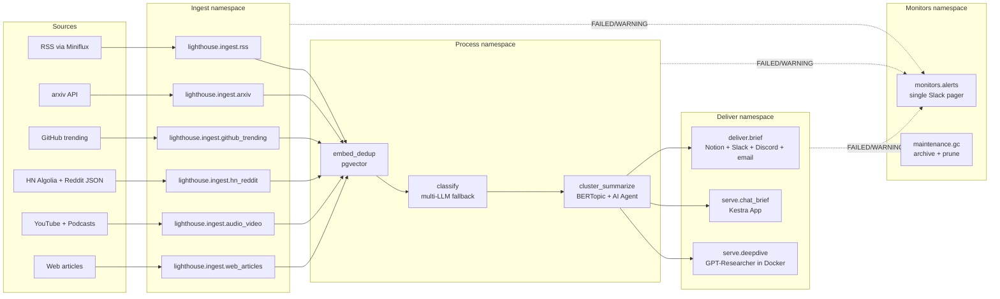

# Lighthouse — A Configurable Multi-Source Research OS, Orchestrated by Kestra

> One engine. Four topic profiles. Daily research briefs to Notion, Slack, Discord, and email. Chat-the-brief and on-demand deep-dives via Kestra Apps. Drop a YAML topic file in, get a personalised brief tomorrow.

[](https://github.com/guglxni/lighthouse-kestra/actions/workflows/validate-flows.yml)

---

## What it is

Lighthouse is a research operating system built entirely on Kestra. It ingests
RSS, arxiv, GitHub trending, HN/Reddit, transcribed YouTube/podcasts, and any
arbitrary web URL; embeds and de-duplicates everything in pgvector; classifies
and summarises through **LiteLLM** (OpenAI-compatible `baseUrl`) with optional
multi-model / Azure Kimi fallbacks (see [`CONVENTIONS.md`](CONVENTIONS.md)); and
delivers a daily brief to your channels. Everything is configured via a single
YAML topic profile, so spinning up a brief for a new topic takes one file — no
code changes.

**LLM / BYOK:** Models are **not** locked to a single vendor. Kestra talks **OpenAI-compatible** HTTP to LiteLLM (or any gateway you point `LITELLM_BASE_URL` at). You define providers and aliases in [`infra/litellm/config.yaml`](infra/litellm/config.yaml). See [`docs/BYOK.md`](docs/BYOK.md) (includes **Exa BYOK** for semantic search).

**Real ingest, no mocks:** All seven core source types call live APIs/feeds and persist to Postgres (see [`docs/INGEST_SOURCES.md`](docs/INGEST_SOURCES.md)). **Heroku / student credits:** see [`docs/DEPLOY_HEROKU.md`](docs/DEPLOY_HEROKU.md) — the default stack targets Docker Compose; full Heroku parity is non-trivial.

Four topic profiles ship preconfigured:

- `agentic-eng` — Anthropic / OpenAI / Cursor / MCP / agent frameworks
- `solana-zk` — Solana protocol + ZK proof systems + audits
- `indie-saas` — Bootstrapped SaaS, distribution, growth case studies
- `data-eng-ai` — Lakehouse, orchestration, vector DBs, RAG infra

## WeMakeDevs × Kestra orchestration challenge

If you are taking part in **[The Kestra Orchestration Challenge](https://www.wemakedevs.org/orchestration)** (May 4–17, 2026): register, complete **Kestra Fundamentals** on [Kestra Academy](https://academy.kestra.io), get certified, then post with **`#KestraAcademy`**. Lighthouse is a project you can showcase *after* certification — it is not a substitute for those steps.

---

## Quickstart

```bash
git clone https://github.com/guglxni/lighthouse-kestra.git
cd lighthouse-kestra
cp .env.example .env       # fill LiteLLM + provider keys (see table)
docker compose -f infra/docker-compose.yml up -d
open http://localhost:8080 # Kestra UI; Apps live under /ui/apps
```

Required secrets (set in `.env` or your secret manager):

| Secret | Purpose |
| --- | --- |
| `LITELLM_BASE_URL`, `LITELLM_API_KEY`, `LITELLM_MODEL_PRIMARY` | Kestra → LiteLLM proxy (canonical path) |
| `OPENAI_API_KEY` | Upstream for LiteLLM **and** optional direct scripts |
| `AZURE_OPENAI_*`, `LITELLM_MODEL_FALLBACK` | Optional multi-tier / Azure Kimi fallback |
| `ANTHROPIC_API_KEY`, `GEMINI_API_KEY` | Optional extra providers in LiteLLM config |
| `NOTION_API_KEY`, `NOTION_PAGE_<TOPIC>` | Brief delivery |
| `SLACK_WEBHOOK_URL` | Monitors pager (**Incoming Webhook** — required for `flows/monitors/alerts.yaml`) |
| `SLACK_BOT_TOKEN` | Reserved / optional (delivery flows use webhooks where noted) |
| `KESTRA_PUBLIC_URL` | Base URL in alert messages (no trailing slash) |
| `DISCORD_WEBHOOK_<TOPIC>` | Discord delivery |
| `SENDGRID_API_KEY` | Email delivery |
| `MINIFLUX_TOKEN`, `MINIFLUX_URL` | RSS aggregator |
| `SEARXNG_URL` | Self-hosted meta-search for chat |
| `GITHUB_TOKEN` | GitHub trending |
| `REDDIT_USER_AGENT` | Reddit JSON polling |
| `EXA_API_KEY`, `EXA_API_BASE` | Optional Exa search (BYOK); base defaults to `https://api.exa.ai` |
| `S3_BUCKET`, `S3_REGION`, `AWS_ACCESS_KEY_ID`, `AWS_SECRET_ACCESS_KEY` | Archive (gc flow) |
| `POSTGRES_*` | Auto-set by docker-compose |

Full list and default values in [`.env.example`](.env.example).

## Architecture



Deeper dive in [`ARCHITECTURE.md`](ARCHITECTURE.md). **Ingest source inventory** (all live APIs / feeds): [`docs/INGEST_SOURCES.md`](docs/INGEST_SOURCES.md).

### Architecture graph (Graphify)

[Lighthouse](https://github.com/guglxni/lighthouse-kestra) uses **[Graphify](https://github.com/safishamsi/graphify)** to turn the canonical docs plus a generated flow index into a **browsable knowledge graph** (`graph.json`, interactive HTML, `GRAPH_REPORT.md`). That helps contributors see how **namespaces**, **ingest → process → deliver** paths, **LiteLLM BYOK**, and **data/PG** concepts connect without re-reading every YAML file.

**One command** (from repo root, with an LLM key set for markdown semantic extraction — default backend `openai`):

```bash
./scripts/graphify_lighthouse.sh
# or
make graphify
```

Outputs land in `docs/graphify/output/` (gitignored if large). The script copies `graph.html` → `report.html` for a stable name. Optional call-flow HTML: `GRAPHIFY_CALLFLOW=1 ./scripts/graphify_lighthouse.sh`.

**Install (pick one)** — Graphify’s PyPI package is `graphifyy` (CLI remains `graphify`); use **0.7+** for `graphify extract`:

```bash
uv tool install graphifyy && graphify install
# or: pipx install graphifyy && graphify install
```

If your globally installed `graphify` is older, the script falls back to **`uvx --from 'graphifyy>=0.7.13'`** when `uv` is available. Set `GRAPHIFY_BACKEND` (e.g. `gemini`, `claude`) and the matching API key per [Graphify’s README](https://github.com/safishamsi/graphify/blob/v7/README.md).

**Groq (full repo `graphify extract`):** Graphify has no dedicated `groq` backend, but Groq’s HTTP API is OpenAI-compatible. Use the **`ollama` backend** (same OpenAI client) with Groq’s base URL and a current API key from [Groq Console](https://console.groq.com/keys). The `openai` Python package must be available (`uvx --with openai` bundles it).

Graphify’s `ollama` backend sends Ollama-only fields (`keep_alive`, large `max_completion_tokens`) that Groq rejects. Use the repo helper **`scripts/graphify_extract_groq.py`**, which patches those calls for `groq.com` URLs. Many Groq models cap **`max_completion_tokens` at 8192** — set `GRAPHIFY_MAX_OUTPUT_TOKENS=8192` or extraction may return HTTP 400.

```bash
export OLLAMA_BASE_URL="https://api.groq.com/openai/v1"
export OLLAMA_API_KEY="your_groq_key"   # starts with gsk_
export GRAPHIFY_MAX_OUTPUT_TOKENS=8192
uvx --with openai --from graphifyy python scripts/graphify_extract_groq.py extract . \
  --backend ollama \
  --model "meta-llama/llama-4-scout-17b-16e-instruct" \
  --out .
```

Outputs appear under `./graphify-out/` (`graph.json`, `graph.html`, `GRAPH_REPORT.md`). If semantic chunks fail, confirm the key is valid (401 / `expired_api_key` means rotate the key in Groq), that `uvx` includes `--with openai`, and that output token cap matches the model.

**Submodule (optional):** vendor Graphify next to this repo for skills/hooks or local patches (use on **case-sensitive** filesystems; default macOS APFS is often case-**in**sensitive and upstream may appear permanently dirty):

```bash
git submodule add https://github.com/safishamsi/graphify graphify
git submodule update --init --recursive
```

CI does not run Graphify by default (LLM keys); refresh graphs on release or when architecture docs change.

## Feature → Kestra capability mapping

| Feature | Kestra capability | Where |
| --- | --- | --- |
| Realtime trigger on new RSS items | `io.kestra.plugin.core.trigger.Webhook` | `flows/ingest/rss.yaml` |
| Schedules everywhere | `io.kestra.plugin.core.trigger.Schedule` | every ingest + `deliver/brief.yaml` |
| Fan-in on any ingest success | `io.kestra.plugin.core.trigger.Flow` | `flows/process/embed_dedup.yaml` |
| Multi-LLM fallback chain | `io.kestra.plugin.ai.completion.Classification` + `runIf` | `flows/process/classify.yaml` |
| Multi-tier extraction fallback | `io.kestra.plugin.scripts.python.Script` chain with `runIf` | `flows/ingest/web_articles.yaml` |
| Concurrency limits | `concurrency.limit + behavior: QUEUE` | every ingest/process flow |
| Retries | `retry.constant` on every external call | every flow |
| `allowFailure` for graceful degradation | per-task `allowFailure: true` | every fallback tier + every delivery channel |
| Apps UI | `io.kestra.plugin.ee.apps.App` blocks | `flows/apps/*` |
| Namespace files (topic profiles) | `_namespace_files/topics/*.yaml` | `flows/_namespace_files/topics/` |
| KV store (watermarks, chat history) | `io.kestra.plugin.core.kv.{Get,Set}` | every ingest flow + chat |
| Secrets | `{{ secret('NAME') }}` | every external call |
| Docker task runner | `io.kestra.plugin.scripts.runner.docker.Docker` | Whisper, Trafilatura, BERTopic, GPT-Researcher |
| Postgres JDBC plugin (pgvector) | `io.kestra.plugin.jdbc.postgresql.{Query,Queries}` | dedup, search, brief assembly |
| Notion / Slack / SendGrid / HTTP plugins | delivery + Discord webhook | `flows/deliver/brief.yaml` |
| Single-pager monitor | `Flow` trigger across `lighthouse.*` | `flows/monitors/alerts.yaml` |
| Flow unit tests | `io.kestra.core.tests.Flow` | `tests/flow_tests/` |
| GitOps / `kestra flow validate` | CI workflow | `.github/workflows/validate-flows.yml` |

## FOSS building blocks

| Need | Tool | Why |
| --- | --- | --- |
| RSS aggregation + dedup + webhooks | [Miniflux](https://github.com/miniflux/v2) | Single Go binary, Postgres backend, native webhooks → realtime trigger source |
| Heuristic web extraction | [Trafilatura](https://github.com/adbar/trafilatura) | Free, deterministic, no LLM cost, ~80% pages |
| LLM-friendly extraction fallback | [Jina Reader (`r.jina.ai`)](https://github.com/jina-ai/reader) | JS-rendered, returns clean markdown |
| Audio/video fetch | [yt-dlp](https://github.com/yt-dlp/yt-dlp) | YouTube + podcasts, single CLI |
| Transcription | [faster-whisper](https://github.com/SYSTRAN/faster-whisper) | CTranslate2 INT8, fast on CPU |
| Vector store | pgvector on Postgres | Same DB as Kestra; uses existing JDBC plugin |
| Embeddings (offline option) | [sentence-transformers](https://github.com/UKPLab/sentence-transformers) | Local fallback |
| Clustering | [BERTopic](https://github.com/MaartenGr/BERTopic) | Weekly themes |
| On-demand deep dive | [GPT-Researcher](https://github.com/assafelovic/gpt-researcher) | Apache 2.0, runs in Docker |
| Web search for chat | [SearxNG](https://github.com/searxng/searxng) | Self-hosted meta-search |
| Navigating 20+ YAML flows + docs | [Graphify](https://github.com/safishamsi/graphify) | Optional knowledge graph of ARCHITECTURE / CONVENTIONS / README + flow index (`./scripts/graphify_lighthouse.sh`) |

## Repo layout

```
lighthouse/
  flows/
    ingest/        rss arxiv github_trending hn_reddit audio_video web_articles
    process/       embed_dedup classify cluster_summarize
    deliver/       brief
    serve/         chat_brief deepdive
    apps/          dashboard chat deepdive
    monitors/      alerts gc
    maintenance/   graphify_docs (docs reminder)
    _namespace_files/
      topics/      agentic-eng solana-zk indie-saas data-eng-ai
      prompts/     system.md
  scripts/         transcribe.py extract_trafilatura.py bertopic_cluster.py deepdive_runner.py
  sql/             pgvector_init.sql schema.sql
  tests/flow_tests/test_rss_dedup.yaml test_classify_schema.yaml test_brief_shape.yaml
  infra/           docker-compose.yml Dockerfile.worker
  blueprint/       lighthouse-research-quickstart.yaml PR_BODY.md
  .github/workflows/validate-flows.yml
  README.md ARCHITECTURE.md CONVENTIONS.md docs/ SECURITY.md scripts/graphify_lighthouse.sh
  docs/TODO.md LICENSE
```

## Screenshots

Optional: add images under `docs/img/` after your first successful run (dashboard, chat, brief in Slack/Notion, etc.) and reference them here.

## Security

See [`SECURITY.md`](SECURITY.md) for the threat model (Docker socket, unauthenticated UI, webhook URLs, dependency pins) and how to report issues.

## Contributing

PRs welcome — adding a topic profile is the easiest first contribution: drop a
new file in `flows/_namespace_files/topics/<slug>.yaml`, add a Discord webhook
secret if you want Discord delivery, and the existing flows pick it up.

For larger changes, please open an issue first to align on shape.

## License

MIT — see [`LICENSE`](LICENSE).
