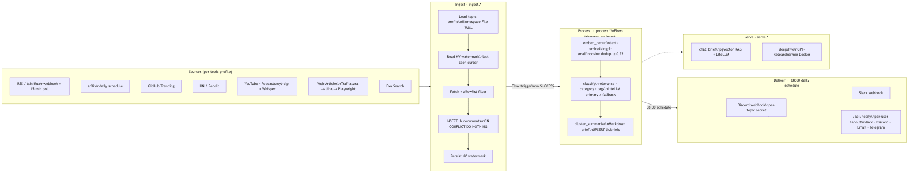
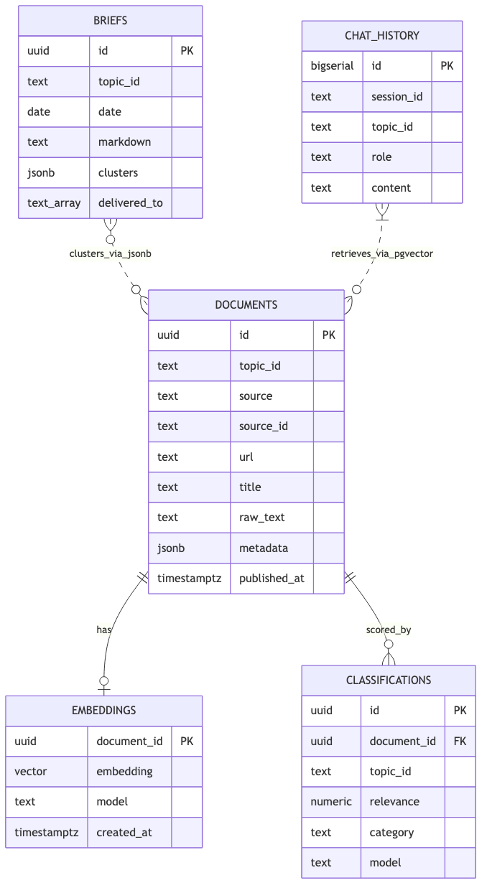
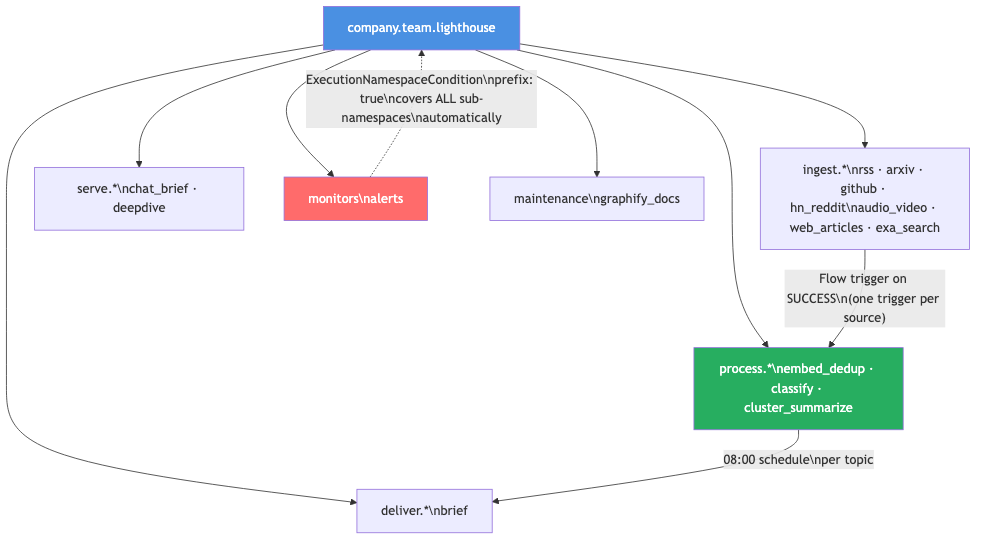

# Building Lighthouse: adding a new ingest source is one YAML file — here's the Kestra architecture that made that true

I added arXiv as a seventh ingest source to Lighthouse last month. The change was exactly one YAML file drop into a namespace directory. No Python changes, no scheduler edits, no deployment reconfiguration. The new source started flowing through embed, classify, and delivery automatically within the next scheduled run.

That extensibility isn't magic. It came from three specific architectural decisions I made early in the build and want to document precisely: using Kestra's Flow triggers instead of a cron-chaining approach, keeping all state in a single Postgres instance rather than spreading it across services, and treating topic profiles as namespace-scoped YAML configuration rather than hard-coded pipeline parameters.

The short version of what I learned: in an AI pipeline, most of the interesting engineering happens outside the LLM calls. Reliability comes from how you handle partial failures. Extensibility comes from where you put your configuration. Operability comes from how many places you have to touch when something breaks.

---

## What Lighthouse is

Lighthouse is a personal research operating system. Every day it ingests content across four topic profiles — Agentic Engineering, Solana ZK, Indie SaaS, Data/AI Infrastructure — from eight sources: RSS feeds via Miniflux, arXiv papers, GitHub trending repositories, Hacker News and Reddit posts, YouTube video transcripts via yt-dlp and faster-whisper, web articles, and Exa semantic search results. It embeds and deduplicates that content in Postgres, classifies each item against the active topic's relevance criteria, clusters the results by theme, and delivers a Markdown brief to Notion, Slack, Discord, and Email. A RAG chat interface and a GPT-Researcher-backed deep dive mode sit on top of the same data.

The code is open-source at [https://github.com/guglxni/lighthouse-kestra](https://github.com/guglxni/lighthouse-kestra). The live demo is at [https://demo-beta-topaz.vercel.app](https://demo-beta-topaz.vercel.app).

| Layer | Tool | Why |
|---|---|---|
| Orchestrator | Kestra LTS | Flow triggers, schedule, KV store, Namespace Files, Apps |
| Storage | Postgres 16 + pgvector | Single database for Kestra state, app schema, and HNSW vector search |
| RSS aggregator | Miniflux | Webhook → realtime trigger; falling back to 15-minute poll |
| Meta-search | SearxNG | Backs optional web search in the chat interface |
| Worker image | Debian-slim Python 3.11 | yt-dlp, faster-whisper, trafilatura, gpt-researcher, sentence-transformers, playwright |


*Figure 1: The full pipeline. Ingest flows are triggered by schedule and webhook; process flows are triggered by ingest SUCCESS events; delivery runs on a morning schedule.*

---

## Flow triggers replaced polling — and changed how I think about the pipeline

The original Lighthouse was a single cron job: 6 AM, run fetch, embed, classify, summarize, deliver, in sequence. The problem wasn't correctness. It was that a single RSS timeout stalled the entire chain, and adding a new source meant modifying the master job.

Kestra's Flow trigger decouples this completely. Each process flow declares which ingest flows should wake it up:

```yaml
# process/embed_dedup.yaml — partial triggers block
triggers:
  - id: after_rss
    type: io.kestra.plugin.core.trigger.Flow
    conditions:
      - type: io.kestra.plugin.core.condition.ExecutionFlow
        namespace: company.team.lighthouse.ingest
        flowId: rss
      - type: io.kestra.plugin.core.condition.ExecutionStatus
        in: [SUCCESS]
    states: [SUCCESS]

  - id: after_arxiv
    type: io.kestra.plugin.core.trigger.Flow
    conditions:
      - type: io.kestra.plugin.core.condition.ExecutionFlow
        namespace: company.team.lighthouse.ingest
        flowId: arxiv
      - type: io.kestra.plugin.core.condition.ExecutionStatus
        in: [SUCCESS]
    states: [SUCCESS]

  - id: after_hn
    type: io.kestra.plugin.core.trigger.Flow
    conditions:
      - type: io.kestra.plugin.core.condition.ExecutionFlow
        namespace: company.team.lighthouse.ingest
        flowId: hn_reddit
      - type: io.kestra.plugin.core.condition.ExecutionStatus
        in: [SUCCESS]
    states: [SUCCESS]
```

The `embed_dedup` flow has six of these triggers — one per ingest source. When RSS succeeds, embedding starts immediately. When Miniflux is temporarily unreachable and RSS fails, arXiv, GitHub trending, and HN each continue on their own schedules without blocking on RSS recovery.

The architectural shift matters: I stopped thinking about the pipeline as a sequence and started thinking about it as an event graph. Each flow is an independent actor that publishes SUCCESS events. Downstream flows subscribe to exactly the events they care about. When I added arXiv, I dropped a new `ingest/arxiv.yaml`, added one trigger block to `embed_dedup`, and the new source was integrated. The existing flows were untouched.

The delivery flow still runs on a schedule (08:00 daily per topic) because "deliver once the brief is ready" is a time-bounded commitment, not an event. Mixing event-driven and schedule-driven triggers in the same namespace is straightforward and I've found no tension between them.

---

## KV watermarks: stateful ingestion without a state machine

Every ingest flow maintains a KV watermark: a timestamp or cursor that marks the last successfully processed item for a given source and topic combination. The RSS flow looks like this:

```yaml
- id: read_watermark
  type: io.kestra.plugin.core.kv.Get
  key: "topic:{{ inputs.topic_id }}:watermark:rss"
  errorOnMissing: false

- id: fetch_entries
  type: io.kestra.plugin.core.http.Request
  uri: >
    {{ vars.miniflux_url }}/v1/entries?status=unread
    &limit={{ inputs.limit }}
    &published_after={{ outputs.read_watermark.value ?? '1970-01-01T00:00:00Z' }}
  method: GET
  headers:
    X-Auth-Token: "{{ vars.miniflux_token }}"
  retry:
    type: constant
    maxAttempts: 5
    interval: PT2S

- id: persist_watermark
  type: io.kestra.plugin.core.kv.Set
  key: "topic:{{ inputs.topic_id }}:watermark:rss"
  value: "{{ read(outputs.parse_entries.outputFiles['watermark.txt']) }}"
```

Each topic×source combination gets its own key: `topic:agentic-eng:watermark:rss`, `topic:solana-zk:watermark:arxiv`, and so on. The first run defaults to Unix epoch — a safe "fetch everything" bootstrap. Subsequent runs only request entries newer than the last known timestamp.

The KV store is Kestra's built-in key-value primitive, backed by the same Postgres instance the orchestrator uses for its own metadata. There is no Redis, no custom tracking table, no file-based cursor. The watermark survives flow reruns, Kestra restarts, and topology changes. For a system that runs unattended at 6 AM, that durability matters.

The KV watermark handles API-level deduplication — it prevents unnecessary API calls. It is not a reliable semantic deduplication mechanism. Network retries and overlapping schedule windows will eventually deliver the same item twice. That's what the database constraint handles.

---

## Database-level idempotency as the real safety net

The `lh.documents` table has a UNIQUE constraint that is the actual deduplication guarantee:

```sql
CREATE TABLE IF NOT EXISTS lh.documents (
    id          UUID PRIMARY KEY DEFAULT uuid_generate_v4(),
    topic_id    TEXT NOT NULL,
    source      TEXT NOT NULL,
    source_id   TEXT NOT NULL,   -- guid, arxiv_id, repo full_name, hn_id, …
    url         TEXT,
    title       TEXT,
    raw_text    TEXT,
    metadata    JSONB NOT NULL DEFAULT '{}',
    UNIQUE (topic_id, source, source_id)
);
```

Every ingest flow uses `INSERT ... ON CONFLICT DO NOTHING`:

```sql
INSERT INTO lh.documents (topic_id, source, source_id, url, title, raw_text, metadata, published_at)
SELECT
    d->>'topic_id', d->>'source', d->>'source_id',
    d->>'url', d->>'title', d->>'raw_text',
    COALESCE(d->'metadata', '{}'::jsonb),
    NULLIF(d->>'published_at', '')::timestamptz
FROM jsonb_array_elements(%(documents_json)s::jsonb) AS d
ON CONFLICT (topic_id, source, source_id) DO NOTHING
RETURNING id, source_id;
```

The `RETURNING` clause tells the ingest flow exactly which rows were new. The embedding flow picks up only documents that have no corresponding row in `lh.embeddings`:

```sql
SELECT d.id, COALESCE(d.raw_text, '') AS t
FROM lh.documents d
LEFT JOIN lh.embeddings e ON e.document_id = d.id
WHERE d.topic_id = %s
  AND e.document_id IS NULL
  AND length(COALESCE(d.raw_text, '')) > 32
ORDER BY d.fetched_at DESC
LIMIT %s;
```

The same pattern repeats in `classify`: it only processes documents that have no `lh.classifications` row for the current primary model. Re-running any flow is safe because the database prevents duplicate work at every stage.

For semantic-level deduplication — the same news item appearing in both an RSS feed and Hacker News — the `embed_dedup` flow runs a cosine similarity check against existing embeddings after inserting new ones. Items with similarity ≥ 0.92 get a `duplicate_of` field written to their `metadata` JSONB column and are excluded from classification and delivery downstream.

---

## One Postgres for everything

Lighthouse uses a single Postgres 16 instance for four distinct workloads: Kestra's own metadata (executions, logs, KV store), Miniflux's RSS database, the application schema (`lh.*`), and pgvector embeddings with HNSW indexing.


*Figure 2: All application state lives in `lh.*`. The UNIQUE constraint on `documents` handles source-level idempotency; the HNSW index on `embeddings` handles vector search. `BRIEFS` clusters are stored as JSONB since their shape evolves without requiring schema migrations.*

The argument for a dedicated vector database does not hold at this scale. At tens of thousands of vectors per topic profile, pgvector's HNSW index (m=16, ef_construction=64) is within 5–10% of dedicated stores on p99 query latency for the nearest-neighbor search patterns I'm running. More importantly, the queries that matter most in this system combine vector similarity with relational filtering — relevance score thresholds, topic filters, semantic duplicate exclusions. These are single SQL statements on a unified schema, not round-trips between two systems:

```sql
SELECT d.title, d.url, c.relevance,
       e.embedding <=> %(query_vec)s AS distance
FROM lh.documents d
JOIN lh.embeddings e  ON e.document_id = d.id
JOIN lh.classifications c ON c.document_id = d.id AND c.topic_id = d.topic_id
WHERE d.topic_id = %s
  AND c.relevance > 0.6
  AND NOT (d.metadata ? 'duplicate_of')
ORDER BY (e.embedding <=> %(query_vec)s) + (1 - c.relevance) * 0.3
LIMIT 10;
```

That query — vector distance blended with LLM-scored relevance, filtered by topic and duplicate status — powers the chat interface's retrieval pass. In a split architecture, you'd need to fetch candidates from the vector store, then join to Postgres for relevance scores, then merge in application code. At production query volumes this is tolerable. It's still unnecessary complexity.

One less service also means one less failure domain, one less monitoring dashboard, one less security surface, and one less backup policy. The tradeoff is that the embedding column is opaque to standard SQL tooling. That tradeoff costs me nothing — I never need to inspect raw embedding bytes, only query against them.

---

## Namespace files: zero-code topic configuration

Every flow in the ingest, process, and deliver namespaces accepts `topic_id` as an input and loads the corresponding profile at runtime:

```yaml
- id: load_profile
  type: io.kestra.plugin.core.namespace.DownloadFiles
  namespace: "{{ flow.namespace }}"
  files:
    - "topics/{{ inputs.topic_id }}.yaml"

- id: parse_profile
  type: io.kestra.plugin.serdes.yaml.YamlToIon
  from: "{{ outputs.load_profile.files['topics/' ~ inputs.topic_id ~ '.yaml'] }}"
```

Profiles live at `flows/_namespace_files/topics/<id>.yaml`. Here is an abridged example for the Agentic Engineering topic:

```yaml
id: agentic-eng
name: Agentic Engineering
sources:
  rss:
    - https://www.anthropic.com/news/rss.xml
    - https://blog.langchain.dev/rss/
    - https://lilianweng.github.io/index.xml
  arxiv_categories: [cs.AI, cs.CL, cs.SE]
  github_queries:
    - "topic:agent stars:>500 pushed:>now-7d"
    - "topic:mcp stars:>100 pushed:>now-14d"
  hn_keywords: [agent, claude, cursor, mcp, "ai coding", eval]
prompts:
  classify: |
    Score 0.0–1.0 for relevance to: AI coding agents (Cursor, Claude Code,
    Copilot, Aider), agent orchestration frameworks (LangGraph, CrewAI,
    AutoGen), MCP / tool-use protocols, evals and observability for LLM apps,
    RAG production patterns, inference and routing engineering.
    Return JSON: {relevance, category, tags, rationale}.
schedule: "0 8 * * *"
delivery:
  notion_page_id: "{{ secret('NOTION_PAGE_AGENTIC') }}"
  slack_channel: "#agentic-eng-brief"
```

The flows are static. The topic profile drives all per-topic behavior: which RSS feeds to allow, which arXiv categories to query, which GitHub search terms to use, the classification prompt the LLM receives, and the delivery targets. Adding a fifth topic — say, "Rust and Systems Programming" — is a single file drop. No Python, no flow changes, no deployment.

This discipline is harder to maintain than it sounds. The temptation when a topic needs special handling is to add an `if inputs.topic_id == "agentic-eng"` branch in the flow. That path leads to flows that accumulate topic-specific logic until they're unreadable. Namespace files enforce a boundary: if you can't express it in the profile YAML, it's a flow concern, not a topic concern.

---

## Parallel delivery with graceful degradation

The delivery flow fans out to Discord, Slack, and a per-user notification endpoint. Each channel runs with `allowFailure: true`:

```yaml
tasks:
  - id: deliver_parallel
    type: io.kestra.plugin.core.flow.Parallel
    concurrent: 4
    tasks:
      - id: send_discord
        type: io.kestra.plugin.notifications.discord.DiscordIncomingWebhook
        allowFailure: true
        url: "{{ secret('DISCORD_WEBHOOK_' ~ inputs.topic_id | upper) }}"
        # …

      - id: send_slack
        type: io.kestra.plugin.notifications.slack.SlackIncomingWebhook
        allowFailure: true
        url: "{{ secret('SLACK_WEBHOOK_URL') }}"
        # …

      - id: notify_per_user
        type: io.kestra.plugin.scripts.python.Script
        allowFailure: true
        # Calls /api/notify on the demo Next.js app.
        # That endpoint fans out to each subscriber's configured
        # Slack webhook, Discord webhook, email, and Telegram chat.
```

The `allowFailure: true` flag is a declarative contract with the orchestrator: this task failing should not fail the execution. The difference from a try/except block is that Kestra still records the task outcome individually. I can query execution history to see which channels are flaky without any custom error-tracking code.

The per-user delivery deserves a note. Lighthouse exposes a `/api/notify` endpoint on the Next.js demo — authenticated with a shared secret stored in Kestra KV. The delivery flow calls that endpoint with the rendered Markdown; the Next.js route iterates over all subscribed users and dispatches their configured channels (Slack, Discord, email, Telegram). A single Telegram bot token with the user's chat ID as the routing key handles per-user delivery without per-user credentials.

---

## One alert flow for all namespaces

When I first built Lighthouse, I added a Slack notification task to the `errors:` block of every single flow. By the fifth flow, the pattern was clearly wrong: twelve copies of the same notification logic, configuration drift between them, and no way to know which ones had drifted.

The right pattern is one flow that watches the entire namespace with `ExecutionNamespaceCondition` and `prefix: true`:

```yaml
# monitors/alerts.yaml
triggers:
  - id: on_lighthouse_failure
    type: io.kestra.plugin.core.trigger.Flow
    conditions:
      - type: io.kestra.plugin.core.condition.ExecutionNamespaceCondition
        namespace: company.team.lighthouse
        prefix: true
      - type: io.kestra.plugin.core.condition.ExecutionStatusCondition
        in: [FAILED, WARNING]
    inputs:
      failed_flow: "{{ trigger.flowId }}"
      failed_namespace: "{{ trigger.namespace }}"
      failed_execution_id: "{{ trigger.executionId }}"
      failed_state: "{{ trigger.state }}"
```

The task is a single `SlackIncomingWebhook` that posts the flow path, execution ID, and a direct link to the Kestra UI. Because `prefix: true` matches `company.team.lighthouse.*`, every flow under any sub-namespace is covered automatically. When I added `serve.deepdive` and `maintenance.graphify_docs` months after the initial build, both were monitored from their first execution with no configuration change.


*Figure 3: Each ingest flow fires a Flow trigger into `process.*` on SUCCESS. The monitors.alerts flow watches the entire namespace with a single `prefix: true` condition — any new sub-namespace is automatically covered.*

Monitoring coverage that's additive by default is an underrated property of this approach. In a system that grows over time, the gap between "what you think is monitored" and "what is actually monitored" tends to widen. The namespace prefix trigger collapses that gap to zero.

---

## The serve layer: RAG chat and deep dives

The two Apps that sit on top of the pipeline are `chat_brief` and `deepdive`.

`chat_brief` is a standard retrieval-augmented generation flow. The retrieval query blends pgvector cosine distance with the `relevance` scores from `lh.classifications` — a single SQL query against the unified schema rather than a cross-service fetch. The top-10 results go into the context window alongside the user's question. Chat history is persisted to `lh.chat_history` and to Kestra KV by session ID. Response latency is dominated by the LLM call, typically under 3 seconds at p99 for the models I'm routing through LiteLLM.

`deepdive` runs GPT-Researcher in a Docker container with access to the SearxNG meta-search backend. The Kestra App form uses `wait: true` so the user sees a spinner while the container runs — no manual polling needed. A 10-minute timeout bounds the worst case. Deep dives are gated to explicit user action because the cost is real: one report runs roughly $0.30 to $2.00 depending on search depth and the model mix GPT-Researcher selects. That cost structure is visible in the `lh.classifications` model column — I can query which tier handled which documents and audit the cost attribution.

---

## Extension points and operational cost

**Adding a new source** means dropping a new flow under `flows/ingest/`. The `embed_dedup` Flow trigger picks it up as soon as you add the corresponding trigger condition — one block of YAML. The existing flows need no other changes.

**Adding a new delivery channel** means adding one parallel task to `deliver/brief.yaml` with `allowFailure: true`. The monitoring alert covers it automatically.

**Adding a new topic** is a single namespace file with no flow changes.

On cost: at approximately 200 ingested documents per topic per day, the classification pass (relevance scoring + category + tags) with a fast tier model through LiteLLM runs well under $0.10 per topic per day. The summarization pass — a few dozen clusters per day — is more expensive because of the long-context chat completions, but it's the dominant cost in an expected daily spend still measured in cents, not dollars. Deep dives are the outlier and they're user-triggered.

---

## What building this taught me about declarative orchestration

A sequenced cron pipeline has one bottleneck that's also its failure mode: the entire chain moves at the speed of its slowest component. An event-driven flow graph distributes that bottleneck — each source and each processing step operates at its own rate. Adding a slow or unreliable source degrades that source's contribution to the brief, not the whole pipeline.

The other thing that surprised me: most of the code I was tempted to write was already handled by the orchestrator. Watermarking, retry policies, conditional execution, parallel tasks, KV state, secret injection, scheduling — I reached for Python for all of these in the first draft. In the final version, the Python runs inside Docker containers and handles the domain logic: parsing feed entries, calling embedding APIs, running SQL. The orchestration layer handles everything else.

The code that runs today looks nearly identical to the first working version, not because I got everything right the first time, but because the abstractions I chose didn't require re-architecting when requirements changed. The eighth source was a YAML file. The ninth one will be too.

---

*Aaryan Guglani is a software engineer building AI and data platforms. This post is based on Lighthouse, an open-source research OS orchestrated on Kestra. Code: [https://github.com/guglxni/lighthouse-kestra](https://github.com/guglxni/lighthouse-kestra). Live demo: [https://demo-beta-topaz.vercel.app](https://demo-beta-topaz.vercel.app).*
